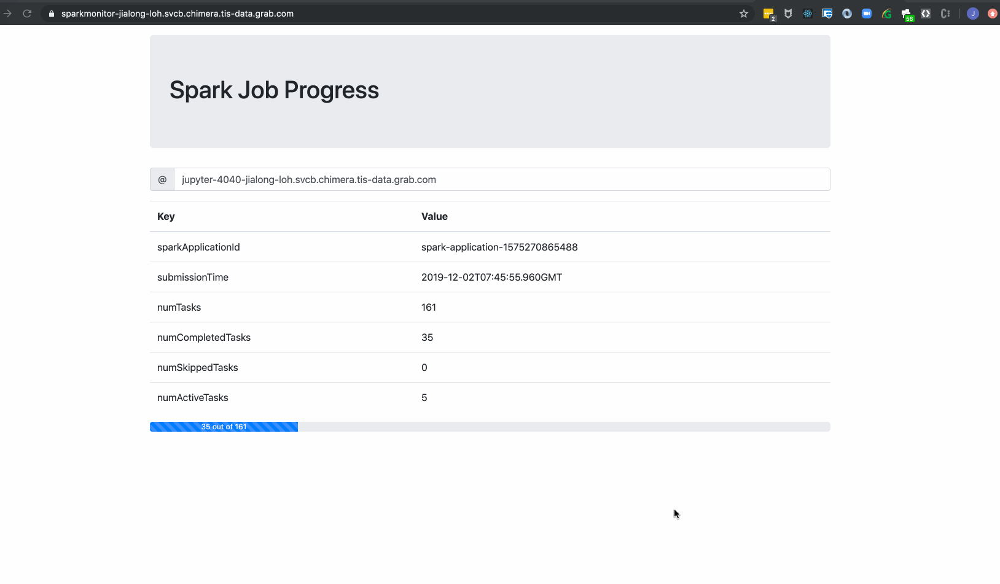

## Introduction
Simple web UI built using ReactJs to periodically scrape a Spark web UI's API to get a progress bar for the current job status

## Instructions
### Local Testing
* Build the docker image
```
docker build . -t sparkreact:test
```
* Run it 
```
docker run -p 5000:5000 sparkreact:test
```
* Go to localhost:5000, and key in your Spark web url into the Text Box, e.g.
```
jupyter-4040-<user>.svcb.chimera.tis-data.grab.com
```

### Build for Chimera
* Build the docker image
```
docker build . -t 406280264215.dkr.ecr.ap-southeast-1.amazonaws.com/sparkui-react:latest
```
* Push Image
```
docker push 406280264215.dkr.ecr.ap-southeast-1.amazonaws.com/sparkui-react:latest
```

## Sample
